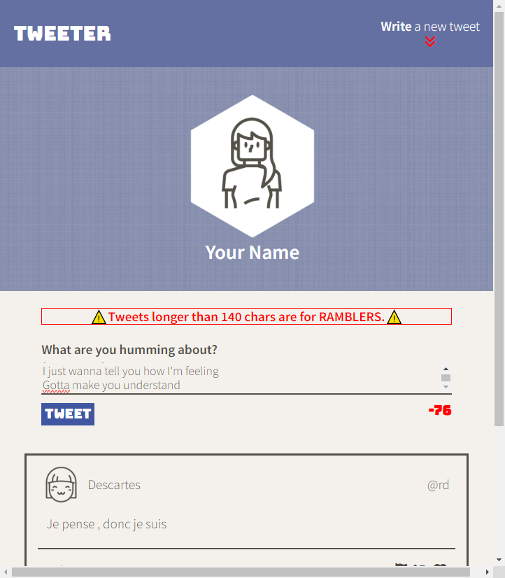

# Tweeter Project

Tweeter is a simple, single-page Twitter clone.

This application allows users to post their (possibly a bit too private) thoughts for the world to see! 

## Getting Started

1. Clone this repo: `gh repo clone Desyn6/tweeter`
2. Install the required dependencies: `npm install`
3. Start the application: `npm start local`
4. Access Tweeter at `localhost:8080`

## To Use

1. Write your thoughts into the text input field under "What are you humming about?"
2. Hit Tweet!

Your tweets must be greater than 0, but no greater than 140 characters long. While we would love to help you share your thoughts with the world, this app is called Tweeter, not Rambler.

If the Tweet text input field is not visible, click anywhere on "Write a new Tweet" to show and hide the Tweet interface!

## Features

### Error Messages
An error message will appear if a user tries to send an empty Tweet and accuse the user of being a mumbler. Clever, we know. A different error message will appear if a user tries to send more than 140 characters in a single Tweet. We lovingly accuse these users of being ramblers. 

### Character Counter
Tweeter features a character counter on the bottom right of the Tweet form! Your users will _love_ that feeling of impending doom as they try to fit their life stories into 140 characters. 

This counter will also turn red when the character count exceeds 140. The counter will then indicate the number of characters by which the limit has been exceeded. 

### Tablet and Desktop Responsive Design
The interface will automatically change from a mobile-device layout (screens narrower than 1024 pixels) and a desktop layout (screens 1024 pixels or wider).

### Mouse-Over Visual Feedback

The following items will change visually upon mouse hover-over!

* The Write a new Tweet button
* Individual Tweet windows
* The report, retweet, and like buttons on each Tweet

### Return-to-top Button

We don't like scrolling forever to get back to the top of a page and I don't think you do either. We've therefore taken the liberty of adding a "Scroll-to-top" button which appears only when you're scrolled away from the top of the page. 

Clicking this button will also unhide the Tweet form, and automatically focus on the text input. 

## Dependencies

- Body-parser 1.15.2 or above
- Chance 1.0.2 or above
- Express 4.13.4 or above
- md5 2.1.0 or above
- Node 5.10.x or above

## Known bugs 

Tweets containing only spaces will not be caught by the empty-Tweet error handler. 

## Interface Images
Interface with hidden Tweet form

Interface with unhidden Tweet form (accessible by clicking Write a new Tweet)

Interface showing error message for empty Tweets

Interface showing error message for Tweets exceeding 140 characters

Interface showing scroll-to-top-button

Interface for displays wider than 1024 pixels
